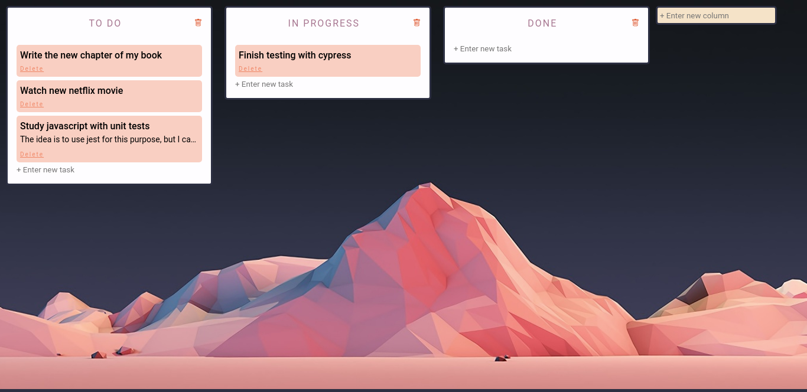

# My Trello! 🥰

➡️ **Preview**: [my-trello-app.netlify.app](https://my-trello-app.netlify.app/)

This small and simple project was made for studies with the aid of the Vue Mastery platform, however the functionalities have been expanded and the idea is to improve it a little more.
But the application is now available for use!

## Project setup
```
npm install
```

### Compiles and hot-reloads for development
```
npm run serve
```

### Compiles and minifies for production
```
npm run build
```


